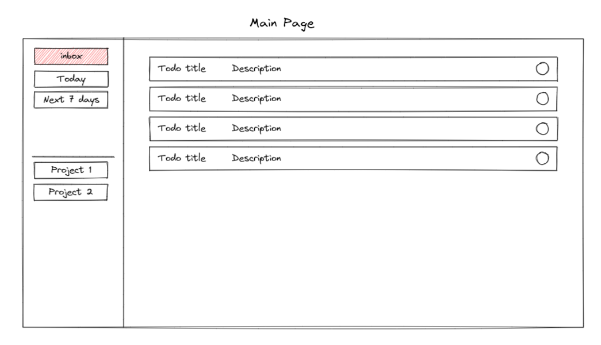
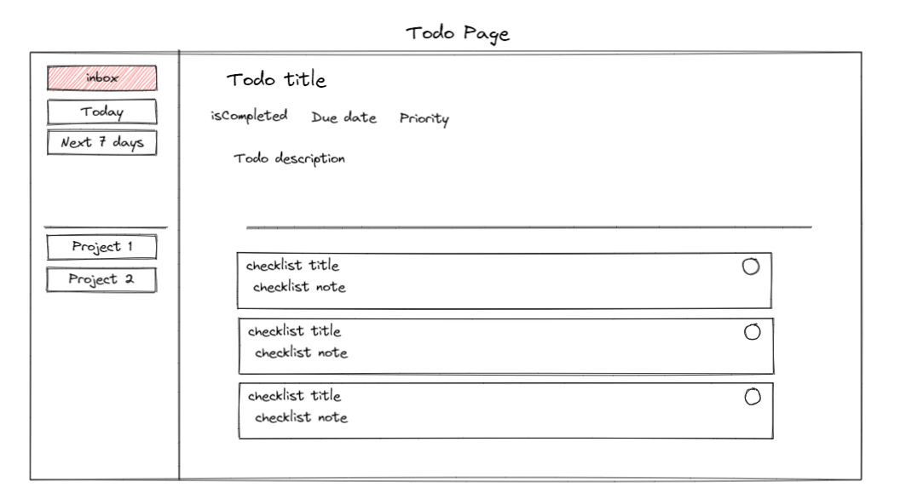

# Todo App

## What should the app be able to do

- Let users add and modify todos

## Features of the app

- Group todos by lists or projects
- Each project has:
  - Id
  - Status i.e is completed or not
  - List of todos (optional)
  - Theme (optional)
  - Icon (optional)
- Each todo has a:
  - Id
  - Title
  - Status (defaults to not completed)
  - Description (optional)
  - Due date (optiona)
  - Priority (optional)
  - subTodos (optional)
- Each subTodo has:
  - Id
  - Title
  - Statues
  - Priority
- For todos with a due date there will be two default lists
  - A list for todos that are due today
  - A list for todos that are due in the next 7 days

## Steps

- Create a simple version of the application without any fancy UI
- Use broswer local storage to save todos
- Start implementing UI

## Sketches

### Main Page

### Todo Page

